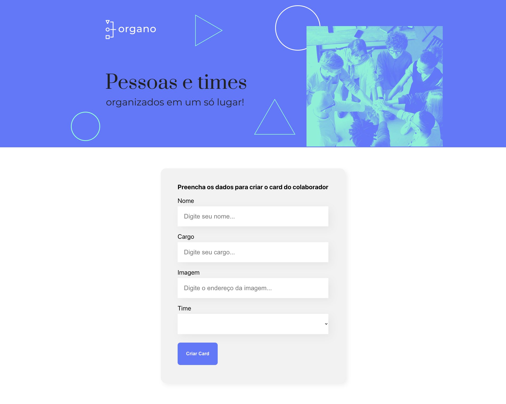

# Organo

## ✔️ Techniques and technologies used

Check out this list of everything we will use in this training:

  
  

- `React`
- `React Hooks`
- `TypeScript`

And much more!

## 🛠️ Open and run the project

To open and run the project, run `npm i` to install the dependencies and `npm start` to start the project.

Then, access <a href="http://localhost:3000/">http://localhost:3000/</a> in your browser.

# OrganoTSapp
